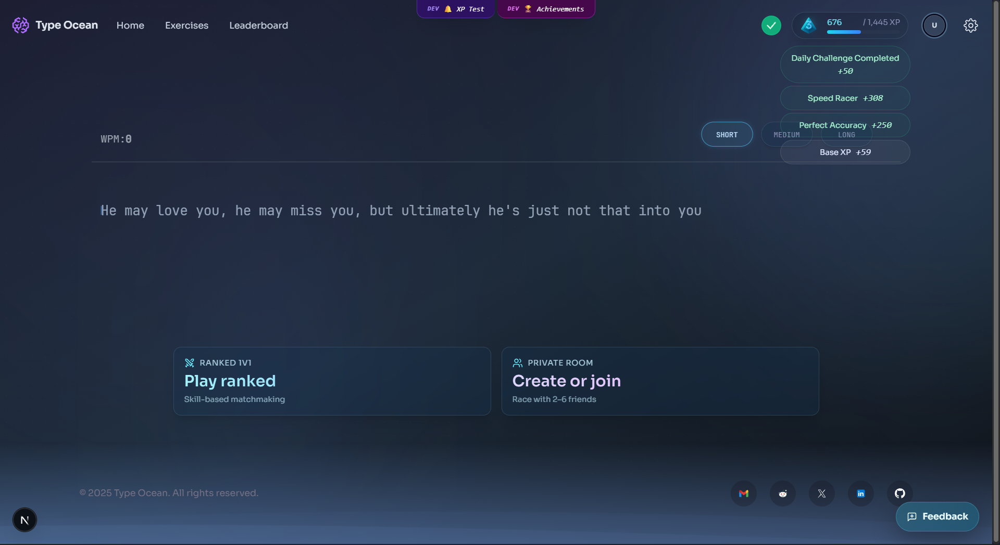
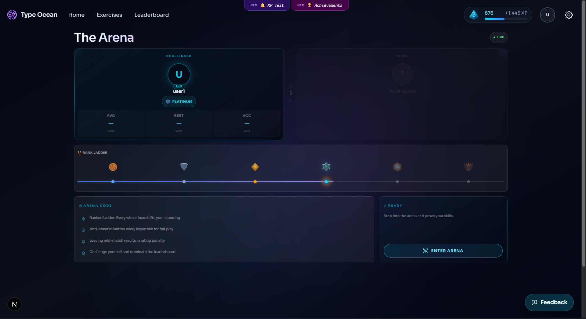
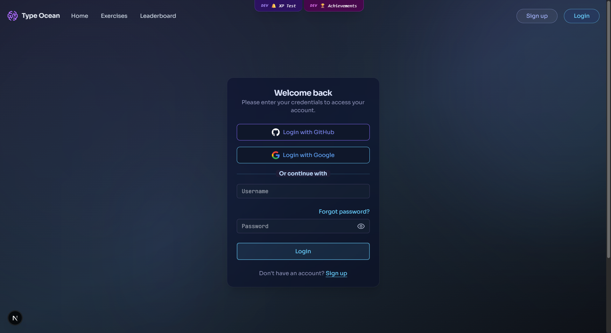
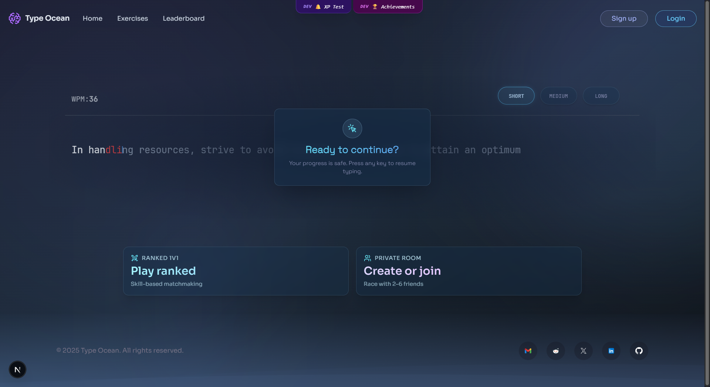

# Type Ocean

**A gamified typing platform with real-time performance feedback, progression systems, and competitive multiplayer races.**

> **Project status — Portfolio side project.** Type Ocean began as my first major full-stack application. I regret not being able to complete every idea I planned; its scope eventually became too large for one developer. Still, building it became a valuable, hands-on education in architecture, real-time systems, testing, debugging, and production-minded development.

## Overview

Type Ocean explores how focused practice, clear feedback, and game mechanics can make typing improvement more engaging. It combines a responsive typing experience with accounts, progression, challenges, rankings, and an authoritative WebSocket-based PvP system.

## Highlights

- Live WPM, accuracy, error tracking, keyboard insights, and session feedback.
- XP, levels, achievements, daily challenges, streaks, and rank progression.
- Ranked 1v1 matchmaking and private rooms for 2–6 players.
- Server-authoritative PvP flow with reconnect, rematch, anti-cheat, and result persistence.
- Account management, profiles, leaderboards, admin tools, monitoring, and load-test tooling.
- Responsive interfaces with motion, clear hierarchy, and immediate visual feedback.

## UI / UX

The interface uses a consistent deep-ocean palette, cyan and violet accents, generous spacing, and focused cards to keep complex game states readable. Feedback is designed to feel immediate: typed characters, errors, XP rewards, challenge completion, rank progress, and multiplayer readiness are all surfaced without interrupting the main task.

<table>
  <tr>
    <td width="50%">
      
      <sub><b>Typing & progression</b> — Immediate performance and reward feedback.</sub>
    </td>
    <td width="50%">
      
      <sub><b>PvP arena</b> — Rank, player state, and matchmaking in one focused view.</sub>
    </td>
  </tr>
  <tr>
    <td width="50%">
      
      <sub><b>Authentication</b> — A clear entry point with local and OAuth options.</sub>
    </td>
    <td width="50%">
      
      <sub><b>Session continuity</b> — Progress is preserved when focus is interrupted.</sub>
    </td>
  </tr>
</table>

<p align="center">
  
  <br />
  <sub><b>Profile experience</b> — Progress, identity, and personal performance presented as one cohesive journey.</sub>
</p>

## Tech Stack

| Area | Technologies |
| --- | --- |
| Web | Next.js 15, React 19, TypeScript, Tailwind CSS, Framer Motion |
| Data & auth | PostgreSQL, Drizzle ORM, Auth.js, Redis |
| Real-time | Node.js, WebSockets, JWT, server-authoritative game state |
| Quality | Jest, Testing Library, Cypress, ESLint, k6 load tests |
| Operations | Vercel, Prometheus metrics, structured logging, health checks |

## Engineering Focus

- Separation between the Next.js application and the persistent PvP gateway.
- Transactional match results, idempotent persistence, and failed-write recovery.
- Authentication, authorization, rate limiting, validation, and secure gateway origins.
- Reconnect handling, heartbeat monitoring, matchmaking, and multiplayer state recovery.
- Unit, integration, browser, and WebSocket load-testing foundations.

## Local Setup

Requirements: Node.js 20+, PostgreSQL, and optionally Redis.

```bash
git clone https://github.com/pqun7/Type-Ocean.git
cd Type-Ocean
npm install
cp .env.example .env.local
npm run drizzle:migrate
npm run dev
```

For PvP development, run `npm run pvp:gateway:dev` in a second terminal. The gateway is deployed separately from the Next.js application because it maintains long-lived WebSocket connections.

## Verification

- **Automated tests:** 65 suites and 412 tests passing.
- **Production build:** Next.js application builds successfully.
- **PvP gateway:** TypeScript production build succeeds.

## Project Status

Type Ocean is kept as a portfolio and side project rather than continuously expanding its already ambitious scope. It represents the practical engineering lessons I gained from designing, building, testing, and stabilizing a substantial product independently.

---

Built independently as a long-term learning project.
